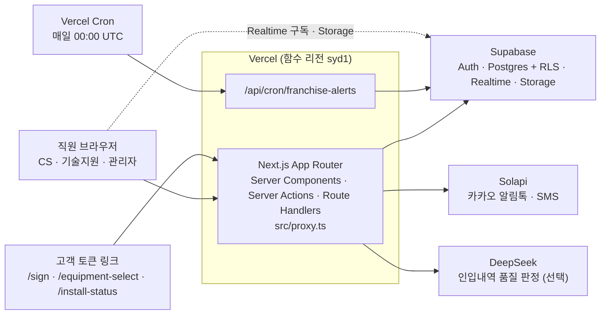
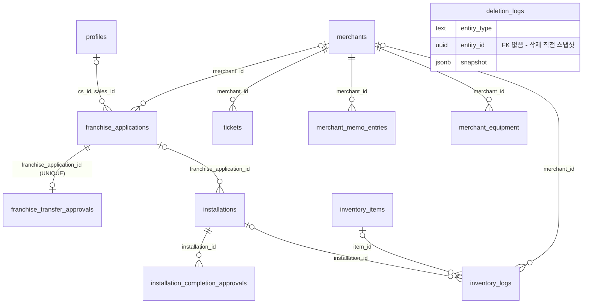

# merchant-ops-system — 가맹점 운영 관리 시스템

> POS 설치·운영 대행사의 가맹 접수 → 심사 → 설치 → 인터넷 개통 → 사후관리(CS)를 한곳에서 처리하는 사내 운영 시스템

     

- **문제**: 가맹 접수부터 설치, 인터넷 개통, CS까지의 업무가 엑셀 CRM 대장, 인터넷 관리대장, 메신저에 흩어져 있었다.
- **해결**: 업무 흐름을 하나의 웹 시스템으로 옮겨 CS·기술지원·관리자가 각자 화면에서 일하고, 결과가 가맹점 단위 기록으로 모이게 했다.
- **내 역할**: 2인 팀의 주 개발자로 초기 설계와 모든 기능 모듈의 최초 구현을 맡았다(커밋 91.7%, 현재 코드 라인 89.8%).

## 프로젝트 개요

### 배경

회사의 가맹 업무는 엑셀 CRM 대장, 인터넷 관리대장, 메신저로 흩어져 있었고, 이 시스템은 그 업무를 웹으로 옮겨 왔다. 제휴 채널 고객 대장 스키마([supabase/013_woo_customers_schema.sql](supabase/013_woo_customers_schema.sql) 2~3행 주석)는 엑셀로 관리하던 고객관리대장 데이터를 옮겨 오는 테이블이라고 밝히고 있고, 인터넷 개통 대장([supabase/015_internet_management_schema.sql](supabase/015_internet_management_schema.sql))도 엑셀 관리대장 시트를 옮긴 테이블이다.

### 해결한 문제

- CS, 기술지원, 관리자가 각자 화면에서 일하고, 결과는 가맹점 단위 기록으로 모인다.
- 누가 언제 어디까지 처리했는지가 활동 로그, 승인 로그, 삭제 로그로 남는다.
- 가맹접수와 설치 상태가 바뀌면 고객에게 카카오 알림톡이 나간다.
- 규모는 `page.tsx` 44개, 서버 액션 파일 14개, API 라우트 9개, 번호가 붙은 SQL 마이그레이션 148개다.

## 팀 구성과 내 역할

| 항목      | 내용                                                                                               |
| --------- | -------------------------------------------------------------------------------------------------- |
| 기간      | 2026-06-19 ~ 2026-09-28 (원본 저장소 커밋 기준). 동료 개발자는 2026-07-10 ~ 2026-07-31에 참여했다. |
| 인원      | 2명 — 본인(주 개발)과 동료 개발자 1명                                                              |
| 원본 커밋 | 832개 — 본인 763개, 동료 69개                                                                      |
| 내 역할   | 프로젝트 초기 설계와 구축, 모든 기능 모듈의 최초 구현, 인증·권한, 성능 개선, 전산 점검             |

**기여도 (원본 저장소 실측)**

| 지표                                                                             | 본인           | 동료           |
| -------------------------------------------------------------------------------- | -------------- | -------------- |
| 커밋                                                                             | 763 (91.7%)    | 69 (8.3%)      |
| 현재 코드 라인 (src·supabase·scripts 420개 파일, `git blame -w`, 포맷 커밋 무시) | 60,345 (89.8%) | 6,883 (10.2%)  |
| 누적 추가 라인                                                                   | 97,718 (74.3%) | 33,866 (25.7%) |
| 누적 추가 라인 (Prettier 일괄 포맷 커밋과 번호 변경 커밋 2개 제외)               | 97,718 (90.9%) | 9,836 (9.1%)   |

동료의 누적 추가 33,866줄 중 24,030줄은 Prettier 일괄 포맷 커밋과 마이그레이션 파일 번호 변경 커밋, 두 커밋에서 나왔다.

**동료 담당 영역**

- 전자계약 서명 PDF 생성과 서버 렌더링 서명 화면. 모바일과 카카오톡 인앱 브라우저 대응을 포함한다.
- 가맹접수 채널·구분·옵션 3축 재설계와 가맹접수–가맹점 연결 설계(`docs/feature/franchise-receipts/`, `supabase/091`, `supabase/092`).
- 설치관리의 명의 변경·전환 구분, 택배발송 메뉴 분리, 설치 사진 썸네일.
- 제휴 채널 고객 대장 → 설치관리 이관.
- 캘린더 범례 필터, 인터넷 개통 3S/백메가(인터넷 대행사) 구분.
- 개발 도구: Prettier, Husky, lint-staged, 커밋 메시지 검사, `docs/commit-convention.md`, `docs/dev-environment.md`, 마이그레이션 번호 체계.

현재 코드에서 동료 비중이 높은 폴더는 다음과 같다.

| 폴더                                                                               | 동료 비중 |
| ---------------------------------------------------------------------------------- | --------- |
| `src/lib/pdf/`, `src/hooks/usePdfPageCanvas.ts`, `src/hooks/usePdfPreviewImage.ts` | 100%      |
| `src/app/sign/`                                                                    | 39%       |
| `src/app/(app)/franchise/`                                                         | 32%       |
| `src/components/layout/`                                                           | 31%       |
| `src/app/(app)/woo/`                                                               | 28%       |
| `src/app/(app)/installs/`                                                          | 25%       |
| `src/app/(app)/contracts/`                                                         | 20%       |
| `src/app/(app)/internet/`                                                          | 14%       |

`src/app/(app)/` 아래의 `tickets/`, `tech-dashboard/`, `overview/`, `cs-report/`, `approvals/`, `admin/`, `blueprints/`, `inventory/`, `dashboard/`는 동료 비중이 0~1%이고, `supabase/`는 4%다.

**본인 담당 영역**

- 프로젝트 초기 설계와 구축(2026-06-19). 모든 기능 모듈의 최초 구현.
- 인증과 권한(역할, 승인 직책, 직급), 기술지원 이관 승인, 설치완료 2단계 결재와 강제완료.
- 가맹접수 상태 파이프라인과 알림톡 부수효과, 확인일과 통화기록.
- 가맹점 360과 통합정보, 인입내역(CS 티켓)과 품질 판정·수정 요청, VAN사별 CS 월간 리포트.
- 재고 자동차감과 택배 체크리스트, 오픈일 D-5/D-3 신호, 직원 일정, 물품요청.
- 감사·삭제 로그, 성능 개선, 전산 점검.

구현 과정에서 AI 코딩 도구(Claude)를 활용했다. 요구사항 정리, 설계 결정, 코드 리뷰, 실데이터 검증과 운영 대응은 직접 했다.

공개용으로 정리하면서 커밋 히스토리를 새로 시작했다. 원본 저장소 커밋 832개(2026-06-19 ~ 2026-09-28). 문서 속 커밋 해시는 원본 저장소 기준이다.

## 주요 기능

| 영역     | 화면                                                                                                                                                                                | 하는 일                                                                                 |
| -------- | ----------------------------------------------------------------------------------------------------------------------------------------------------------------------------------- | --------------------------------------------------------------------------------------- |
| CS 업무  | CS 대시보드 · 가맹 접수 · 제휴 채널 고객 대장(`/woo`) · 변경 관리 · 인터넷 개통 관리 · 대형 가맹점                                                                                  | 리드 확인부터 가맹 접수, 서류·VAN·심사 진행, 인터넷 개통까지                            |
| 기술지원 | 기술지원 대시보드 · 설치 관리 · 택배 발송 · 기사 모바일 페이지(`/installs/mine`) · 완료 사진 · 외부 기사 · 재고 실사 · 설치 설계도                                                  | 설치 일정, 기사 배정, 발송, 완료 확인, 재고 실사                                        |
| 공통     | 승인함 · KPI · VAN사별 CS 월간 리포트 · 캘린더와 직원 일정(모바일 링크) · 가맹점 360·통합정보(`/merchants/[id]`) · 인입내역 · 전자계약·서명 · 물품요청 · 정산 프로모션(`/overview`) | 팀 간 승인 흐름, 지표, 가맹점 단위 통합 조회, 고객 문의와 계약 서명, 프로모션 정산 조회 |
| 관리     | 직원·권한 · 활동 로그 · 승인 로그                                                                                                                                                   | 사용자·권한 관리와 감사 기록                                                            |

- 비로그인 고객 화면은 토큰 링크로 들어온다. 전자 서명(`/sign`), 장비 선택(`/equipment-select`), 설치 현황 조회(`/install-status`)이며, [src/proxy.ts](src/proxy.ts)는 `/login`을 빼면 이 세 경로만 로그인 없이 통과시킨다.
- 상태가 바뀌면 카카오 알림톡(Solapi)이 고객에게 나간다. 사내 알림은 60초 간격으로 확인해 팝업으로 띄우고, 가맹접수·변경 관리·인터넷 관리·전환건·제휴 채널 고객 대장 목록은 Supabase Realtime으로 갱신된다.

## 아키텍처



- 직원 브라우저와 고객 토큰 링크는 모두 하나의 Next.js App Router 앱으로 들어온다. `src/proxy.ts`가 화면 요청마다 세션을 확인하고, 로그인이 없으면 `/login`으로 보낸다.
- [src/lib/supabase/](src/lib/supabase/)에는 `client.ts`(브라우저), `server.ts`(SSR·서버 액션), `admin.ts`(service_role) 세 종류의 클라이언트가 있다. admin은 RLS를 우회하므로 서버 액션에서 권한을 직접 검사한다.
- 함수 리전은 DB(ap-southeast-2) 옆인 `syd1`에 고정했다([vercel.json](vercel.json)). 한국 사용자와의 거리 비용은 [성능 점검 문서](docs/feature/performance-2026-09-14.md)에서 다뤘다.
- 알림톡과 SMS는 Solapi로 보내고([src/lib/solapi.ts](src/lib/solapi.ts)), 인입내역 품질 판정은 DeepSeek을 선택적으로 부른다. Vercel Cron이 매일 00:00 UTC에 `/api/cron/franchise-alerts`를 호출해 가맹접수 알림을 만든다.

## 기술 스택과 선택 이유

| 기술                                   | 선택 이유                                                                                    | 근거                                                                                                                                               |
| -------------------------------------- | -------------------------------------------------------------------------------------------- | -------------------------------------------------------------------------------------------------------------------------------------------------- |
| Next.js 16 App Router + Server Actions | 라우트 하나가 업무 도메인 하나이고, 서버에서 데이터 로드와 권한 검사를 한다.                 | [src/app/(app)/](<src/app/(app)/>), [src/proxy.ts](src/proxy.ts)                                                                                   |
| Supabase (PostgreSQL)                  | Postgres, RLS, Realtime, Storage, Auth를 별도 백엔드 서버 없이 쓴다.                         | [src/lib/supabase/](src/lib/supabase/), [supabase/](supabase/)                                                                                     |
| Solapi                                 | 카카오 알림톡 템플릿과 SMS 발송.                                                             | [src/lib/solapi.ts](src/lib/solapi.ts)                                                                                                             |
| Vercel                                 | 푸시 자동 배포, Cron, DB 인접 리전.                                                          | [vercel.json](vercel.json)                                                                                                                         |
| DeepSeek flash                         | 분류에 가까운 판정이라 저비용 모델로 충분하다. JSON 모드를 쓰고, 실패하면 규칙으로 폴백한다. | [src/lib/qualityJudge.ts](src/lib/qualityJudge.ts#L31-L32)                                                                                         |
| Radix UI, react-day-picker             | 선택 상자와 날짜 입력 같은 공통 입력 컴포넌트.                                               | [src/components/ui/AppSelect.tsx](src/components/ui/AppSelect.tsx), [src/components/ui/DatePickerField.tsx](src/components/ui/DatePickerField.tsx) |
| pdf-lib, pdfjs-dist, @napi-rs/canvas   | 전자계약 서명 PDF 생성. 동료 개발자 담당.                                                    | [next.config.ts](next.config.ts)                                                                                                                   |
| Prettier, Husky                        | 포맷과 커밋 메시지 검사 자동화. 동료 개발자 도입.                                            | [prettier.config.mjs](prettier.config.mjs), [.husky/](.husky/)                                                                                     |

## 핵심 기술 과제와 해결

### 1. 권한·결재 판정 단일화와 결재 잠금 방지

- **문제**: 설치완료 결재는 팀장(1차)과 실장(최종) 두 단계인데, 판정이 화면과 서버에 따로 있으면 버튼은 보이는데 누르면 에러가 난다. 팀장이 올린 건은 요청자와 1차 승인 담당이 같은 사람이 되고 요청자 본인 승인은 막혀 있어, 다른 팀장이 없으면 요청이 `requested`에서 멈추고 재요청도 막혔다. 직급이 비면 모든 판정이 0점이 되어 아무도 결재를 못 푸는 잠금도 생길 수 있었다.
- **해결**: 직급 판정을 `installApproval.ts` 한 파일의 함수로 모으고, 상세 드로어의 버튼과 서버 액션 가드(`installs/actions.ts`)가 같은 함수를 가져다 쓴다. 팀장급 이상이 올린 건은 1차를 건너뛰고 최종 승인 대기로 올려 자기승인 교착을 없앴다. `master`·`admin`은 직급과 무관하게 결재를 풀 수 있는 안전망이다. 최종 승인자가 1차를 대신하지는 않는다. 두 단계가 한 사람에게 몰리면 검토가 형식이 되기 때문이다.
- **근거 코드**: [src/lib/auth/installApproval.ts](src/lib/auth/installApproval.ts) — [`skipsFirstApproval` L37](src/lib/auth/installApproval.ts#L37), [`canApproveFinalBy` L65](src/lib/auth/installApproval.ts#L65), [`canApproveFirstBy` L74](src/lib/auth/installApproval.ts#L74), [`blocksApprovalRequest` L99](src/lib/auth/installApproval.ts#L99)
- **검증/결과**: 2026-09-08 전산 점검에서 이관 승인 권한과 설치 승인 직급은 화면 조건과 서버 가드가 일치함을 확인했다. 어긋난 곳은 설치 일정 변경 버튼 1건뿐이었고 서버 규칙에 맞춰 고쳤다([점검 문서](docs/feature/audit-2026-09-08.md)).

### 2. 재고 수량 동시성과 중복 차감 방지

- **문제**: 재고 조정을 클라이언트가 (현재값 + 변화량)으로 계산해 덮어쓰면 두 사람이 동시에 조정할 때 나중에 도착한 쓰기가 앞선 변경을 지웠다. 설치완료 승인 시 자동 차감은 승인 버튼이 두 번 눌리거나 재시도되면 재고가 두 번 깎일 수 있었다. 택배 건은 실제 보낸 장비가 접수 목록과 달라 차감이 어긋나는 일이 잦았다.
- **해결**: 수량 갱신을 DB 함수로 옮겨 `quantity = quantity + delta`로 원자적으로 반영한다. 자동 차감 함수는 재고 이력에 `installation_id`를 남기고, 같은 설치건으로 이미 차감한 이력이 있으면 통째로 건너뛰어 재시도에도 이중 차감이 없다. 재고 품목명과 맞지 않는 항목은 차감하지 않고 이름을 돌려줘 화면에서 경고한다. 택배 건은 "제품준비" 단계의 체크리스트로 실제 발송 장비와 수량을 확정하고, 저장할 때 가용 재고와 비교해 부족하면 저장을 막는다.
- **근거 코드**: [supabase/056_inventory_adjust_atomic_migration.sql](supabase/056_inventory_adjust_atomic_migration.sql), [supabase/133_inventory_auto_deduct_on_approval.sql](supabase/133_inventory_auto_deduct_on_approval.sql), [supabase/147_delivery_checklist_inventory.sql](supabase/147_delivery_checklist_inventory.sql), [src/app/(app)/installs/deliveryChecklist.ts](<src/app/(app)/installs/deliveryChecklist.ts>), [docs/feature/delivery-checklist.md](docs/feature/delivery-checklist.md)
- **검증/결과**: 체크리스트를 저장하면 설치 품목 목록도 확정 수량으로 덮어써 택배 완료 수량과 재고 출고 수량이 같아진다. 재고 이력에는 택배출고·설치출고 같은 유형이 붙어 실사 차이를 거슬러 추적할 수 있다. 147이 적용되지 않은 환경에서는 체크리스트 저장이 안내 문구로 막히고, 차감 함수는 예전 인자로 다시 호출해 동작한다.

### 3. PostgREST의 조용한 1000행 절단과 URL 길이 한계 대응

- **문제**: Supabase(PostgREST)의 select는 기본 1000행에서 잘리는데 잘렸다는 신호가 따로 오지 않아, 목록이 조용히 일부만 보인다. `.in()` 조회에 ID를 많이 넣으면 URL 길이 제한에 걸려 조회가 통째로 실패한다.
- **해결**: 공용 `fetchAllRows`가 range로 끝까지 읽고, 상한(기본 5000행)에 닿으면 `truncated` 플래그를 세우고 경고를 남긴다. 페이지 경계에서 행이 겹치거나 빠지지 않도록 동점이 없는 정렬을 요구하며, `id`를 마지막 정렬 키로 덧붙인다. `.in()` 조회는 `fetchByIdChunks`로 ID를 150개씩 나눠 묻는다.
- **근거 코드**: [src/lib/fetchAllRows.ts](src/lib/fetchAllRows.ts) — [`fetchAllRows` L36](src/lib/fetchAllRows.ts#L36), [`fetchByIdChunks` L77](src/lib/fetchAllRows.ts#L77), [docs/feature/audit-2026-09-08.md](docs/feature/audit-2026-09-08.md)
- **검증/결과**: 2026-09-08 전산 점검에서 이 함정에 걸린 실제 증상 3건을 찾아 고쳤다. 가맹접수 목록의 설치·인터넷 배지가 조용히 사라지던 문제, 설치관리·내 설치에서 1000건이 넘으면 승인 대기 버튼이 안 뜨던 문제, 택배 통계와 변경관리 목록이 1000행에서 잘리던 문제다.

### 4. 인입내역 품질 판정: 규칙과 LLM 혼합

- **문제**: 인입내역(CS 티켓)의 문의 내용과 해결 절차는 챗봇 학습 데이터로 쓰이므로 품질을 점검해야 한다. 정규식으로 다섯 항목을 판정하다 보니 오탐 패치가 반복됐다. "사장님이 따라 할 수 있는 절차인가"는 의미 판단인데 단어 사전으로 흉내 냈기 때문이다.
- **해결**: 판정을 둘로 갈랐다. 글자 수, 단계 수, 개인정보는 규칙이 보고, 의미 판단 5항목만 모델이 본다. 모델에는 상호·대표자명과 전화·사업자·카드·계좌 번호를 가린 뒤 보낸다. temperature 0, JSON 모드, 8초 타임아웃으로 호출하고, 키가 없거나 호출이 실패하면 규칙 판정으로 폴백한다. 입력 해시에 `JUDGE_VERSION`을 섞어 판정을 티켓에 저장하므로, 내용이 바뀔 때만 다시 부르고 기준을 바꾸면 저장된 판정이 자동으로 무효가 된다.
- **근거 코드**: [src/lib/qualityJudge.ts](src/lib/qualityJudge.ts) — [`JUDGE_VERSION` L29](src/lib/qualityJudge.ts#L29), [`qualityInputHash` L65](src/lib/qualityJudge.ts#L65), [`judgeTicketQuality` L99](src/lib/qualityJudge.ts#L99) / [src/lib/resolutionQuality.ts](src/lib/resolutionQuality.ts) — [`AI_JUDGED_CODES` L431](src/lib/resolutionQuality.ts#L431), [`inspectMechanical` L445](src/lib/resolutionQuality.ts#L445), [`maskPersonalInfo` L473](src/lib/resolutionQuality.ts#L473) / [supabase/148_ticket_quality_verdict.sql](supabase/148_ticket_quality_verdict.sql)
- **검증/결과**: 같은 건이 어제 통과, 오늘 미달로 흔들리지 않도록 판정을 저장으로 고정했다. 운영에서 모델의 사고(thinking) 모드가 토큰을 다 쓰고 본문이 빈 채로 와서 모든 건이 규칙 판정으로 떨어지던 문제를 발견해, 사고 모드를 끄고 본문이 비면 `finish_reason`을 경고 로그에 남기도록 고쳤다([설계 기록](docs/feature/chatbot-training-pipeline.md)).

### 5. 원격 리전 지연 분석과 성능 개선

- **문제**: 서버와 DB가 시드니(ap-southeast-2)에 있고 사용자는 한국이라 화면 하나를 열 때마다 한국↔시드니 왕복(약 130~150ms)이 든다. 운영 통계(Vercel Observability, 함수 P75)에서 `/franchise`는 764ms였고, 인증 확인(`auth.getUser`) 왕복은 230~460ms로 외부 호출 중 가장 느렸다. 가맹접수는 전 건을 조인까지 붙여 매번 가져왔다.
- **해결**: 측정값으로 원인을 거리, 조회량, 인증 왕복으로 나눴다. 거리 비용은 코드로 줄일 수 없고 DB와 함수를 함께 옮겨야 해서 서울 이전은 보류하고, 요청 수를 줄이는 쪽으로 바꿨다. 인증과 프로필 조회는 React `cache`로 요청당 1회로 줄이고, 가맹접수 기본 조회는 진행 중 건과 최근 30일 안에 갱신된 건으로 줄였다(이전 건은 버튼으로 불러온다). 로그인은 서버에서 한 번에 처리해 브라우저에서 DB 인증 서버로 가는 왕복과 화면 이동 중복을 없애고, 이메일을 응답에 싣지 않게 했다.
- **근거 코드**: [src/lib/auth/session.ts](src/lib/auth/session.ts), [`ARCHIVE_AFTER_DAYS` L18](<src/app/(app)/franchise/fetchFranchiseListData.ts#L18>), [`fetchFranchiseListData` L114](<src/app/(app)/franchise/fetchFranchiseListData.ts#L114>), [src/app/api/auth/login/route.ts](src/app/api/auth/login/route.ts), [docs/feature/performance-2026-09-14.md](docs/feature/performance-2026-09-14.md)
- **검증/결과**: 개선 후 수치는 측정 기록이 없어 적지 않는다. 원인 분석과 결정 근거는 문서에 남겼다. 서버 액션은 요청 단위가 달라 캐시가 걸리지 않으므로 기존대로 액션이 직접 권한을 검사한다.

## 데이터 모델 요약



- `deletion_logs`는 삭제 대상 행(`entity_id`)에 FK를 걸지 않고 삭제 직전 스냅샷을 남긴다. 이미 지워진 행을 가리키기 때문이다.
- 상태값은 `src/types/index.ts`와 SQL `CHECK` 제약에서 이중 관리된다. 마이그레이션은 번호순으로 수동 적용하며, 미적용 환경에서도 빈 값으로 동작하게 방어적으로 조회한다.

## 실행 방법

1. `git clone https://github.com/pyobonboy/merchant-ops-system.git` 후 Node 20 이상에서 `npm install`을 실행한다. `postinstall`이 pdf worker를 복사한다([scripts/copy-pdf-worker.mjs](scripts/copy-pdf-worker.mjs)).
2. `cp .env.example .env`로 환경 변수 파일을 만든다. Supabase 3개(`NEXT_PUBLIC_SUPABASE_URL`, `NEXT_PUBLIC_SUPABASE_ANON_KEY`, `SUPABASE_SERVICE_ROLE_KEY`)는 필수이고, Solapi와 DeepSeek는 선택이다. Solapi 값이 비면 알림톡 발송만 동작하지 않고, DeepSeek 키가 비면 품질 판정이 규칙으로만 동작한다.
3. 새 Supabase 프로젝트의 SQL Editor에서 `supabase/*.sql`을 번호순으로 실행한다.
4. `npm run dev`로 개발 서버를 띄우고 http://localhost:3000 에서 확인한다.

SQL을 실행할 때 유의할 점은 다음과 같다.

- 번호가 비어 있는 014, 016, 025, 033~035, 058, 135, 150은 공개용으로 정리하면서 뺀 운영 데이터 이관 파일이다.
- `129_audit_log_actor_name_rollback.sql`은 129를 되돌리는 스크립트이므로 실행하지 않는다. 번호가 없는 `installations_contact_name_migration.sql`은 컬럼을 추가하는 파일이라 함께 실행한다.
- `installations`의 기반 CREATE 문은 저장소에 없다(021이 처음 ALTER 한다). 빈 프로젝트에서 재현하려면 이 테이블을 먼저 만들어야 한다.
- 시드 계정은 없다. Supabase Auth에 사용자를 만들고 같은 id의 `profiles` 행(이름·역할·팀)을 넣어야 이름 로그인이 된다. 이후 직원은 직원 관리 화면에서 만든다.

`.env` 없이 `npm run build`를 하면 페이지 데이터 수집 단계에서 `supabaseUrl is required`로 실패한다. 자격증명이 없는 환경에서는 정상이며, 코드 검증은 `npx tsc --noEmit`으로 한다. 개발용 Supabase 프로젝트와 환경 변수 설명은 [docs/dev-environment.md](docs/dev-environment.md)(동료 개발자 작성)에 있다.

## 테스트

자동화 테스트는 없다. 테스트 러너와 테스트 파일이 저장소에 없고, 검증은 정적 검사에 의존한다.

| 명령                   | 설명               |
| ---------------------- | ------------------ |
| `npx tsc --noEmit`     | 타입 검사          |
| `npm run lint`         | ESLint             |
| `npm run format:check` | Prettier 포맷 검사 |

커밋 훅(husky)은 동료 개발자가 도입했다. pre-commit은 lint-staged(prettier)를, commit-msg는 커밋 메시지 형식 검사를 돌린다. ESLint는 기존 린트 부채 때문에 pre-commit에서 강제하지 않는다. 2026-09-08 전산 점검 시점에 `tsc`와 포맷 검사는 깨끗했고 ESLint는 114건이었다([점검 문서](docs/feature/audit-2026-09-08.md)).

## 폴더 구조

```
src/
  app/
    (app)/          로그인 후 화면 — 라우트 하나가 업무 도메인 하나
    api/            라우트 핸들러 (인증 · 계약 · 크론 · 가맹접수 · 설치)
    login/ sign/ equipment-select/ install-status/   로그인 화면과 비로그인 진입점
  components/       공용 UI
  lib/
    supabase/       client(브라우저) · server(SSR) · admin(service_role)
    auth/           권한 가드
    solapi.ts       알림톡 발송 + 템플릿 매핑
    fetchAllRows.ts 1000행 절단 · URL 길이 대응
    qualityJudge.ts 인입내역 품질 판정 (규칙 + LLM)
  proxy.ts          세션 확인과 로그인 리다이렉트
  types/index.ts    도메인 타입 · 상태 라벨 · 상태 색상
supabase/           번호순 마이그레이션 SQL (SQL Editor에서 수동 실행)
scripts/            보조 스크립트 (pdf worker 복사, 커밋 메시지 검사, 데이터 이관·백업)
docs/               개발 규칙과 기능별 설계 기록
```

### 관련 문서

- [docs/feature/](docs/feature/) — 기능별 설계·작업 기록. 왜 그렇게 만들었는지를 결정 시점에 남겼다(작업 당시 AI 코딩 도구와 함께 작성).
- [docs/development-rules.md](docs/development-rules.md) — 리팩토링·DB 스키마 변경 규칙, 코드 작성 시 주의, 커밋. 1절 초안은 동료 개발자가 작성했다.
- [docs/code-review-2026-07-30.md](docs/code-review-2026-07-30.md) — 코드베이스 전체 오류 검토 보고서
- [docs/feature/audit-2026-09-08.md](docs/feature/audit-2026-09-08.md) — 전산 전체 점검
- [docs/feature/performance-2026-09-14.md](docs/feature/performance-2026-09-14.md) — 성능 점검
- [docs/commit-convention.md](docs/commit-convention.md) (동료 개발자 작성) — 커밋 컨벤션
- [docs/dev-environment.md](docs/dev-environment.md) (동료 개발자 작성) — 개발 환경 세팅
- [docs/feature/franchise-receipts/](docs/feature/franchise-receipts/) (동료 개발자 작성) — 가맹접수 재설계 설계 기록

## 회고와 개선 과제

- **자동화 테스트 도입**: 권한과 상태 전이 함수부터 순수 함수 단위 테스트를 붙인다. 지금은 정적 검사(`tsc`, ESLint)가 전부다.
- **린트 부채**: ESLint 114건(2026-09-08 기준)은 대부분 `any`와 React 훅 규칙이라 손대지 않았다. 이 부채를 줄여야 pre-commit에 ESLint를 다시 넣을 수 있다.
- **대형 클라이언트 컴포넌트 분리**: 설치관리와 가맹접수 화면의 클라이언트 컴포넌트가 3천 줄대다. 렌더 자체는 20ms대라 성능 문제는 아니지만 파일이 너무 크다.
- **서울 리전 이전**: 지연의 근본 원인은 서버와 DB가 시드니에 있다는 점이다. 백업·복원·중단이 따르는 작업이라 보류했고, 옮길 때는 DB와 함수를 함께 옮겨야 한다.
- **마이그레이션 정리**: 수동으로 적용하는 SQL이 150개 안팎이다. 새 개발 환경이 필요해지는 시점에 라이브 스키마 덤프를 기준으로 클린 스키마 세트를 만들고 기존 파일은 `supabase/archive/`로 옮기는 계획이 [docs/development-rules.md](docs/development-rules.md) 1절에 있다. 지금은 `installations`의 기반 CREATE 문이 저장소에 없어 빈 DB에서 순서대로 실행할 수 없다.
- **상태값 이중 관리 위험**: 상태값이 `src/types/index.ts`와 SQL `CHECK` 제약에 따로 있어 한쪽만 바꾸면 저장이 실패한다. 2026-09-08 점검에서는 `info_input` 하나가 어긋나 있었다(세 화면 모두 선택지에서 빠져 있어 영향은 없었다).
